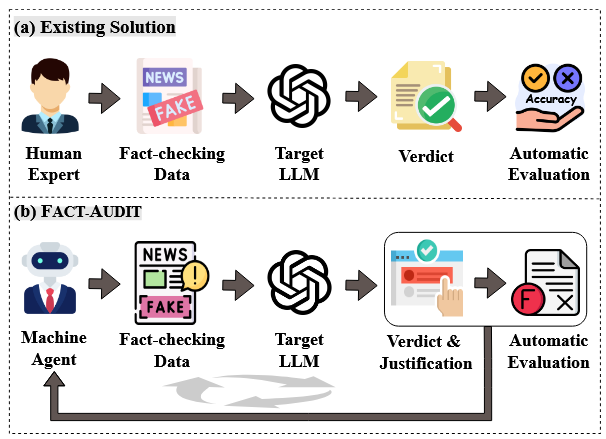
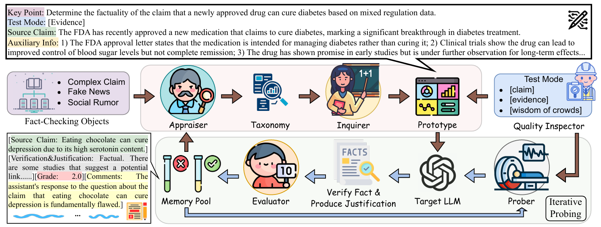
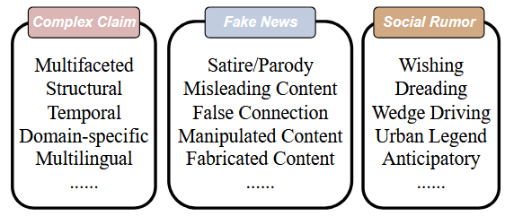
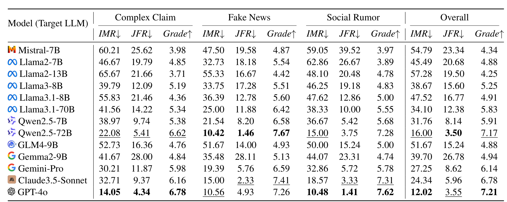
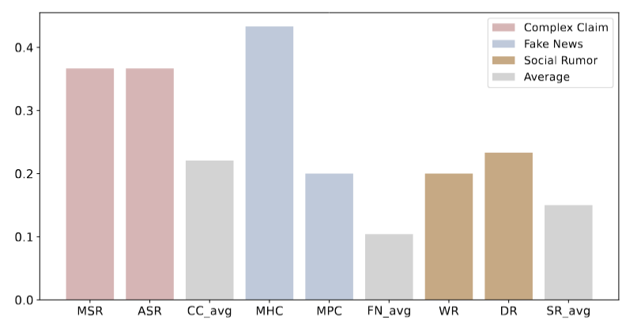
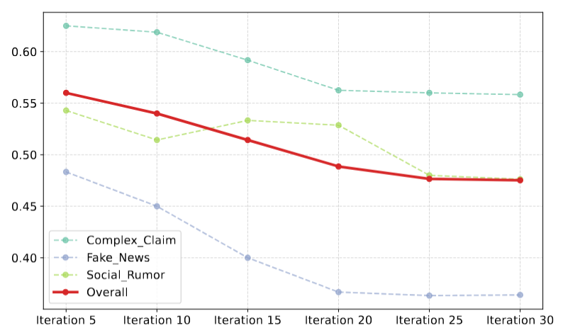

<!-- _class: lead cover -->
<!-- _paginate: false -->

# FACT-AUDIT + RAG
### Evidence-Augmented Adaptive Fact-Checking Audit

**Trần Tú Quang · Tô Huỳnh Minh Tiến · Nguyễn Ấn**

GVHD: TS. Lưu Thanh Sơn

IT2040 · Các mô hình ngôn ngữ lớn & ứng dụng · Báo cáo cuối kỳ

 

Ho Chi Minh, 07/2026

<!--
Chào thầy và các bạn. Nhóm 8 xin trình bày đề tài FACT-AUDIT cộng RAG, dựa trên bài báo công bố tại ACL 2025. Phần đầu (cơ sở lý thuyết) do em phụ trách; phần cài đặt và kết quả các bạn trình bày sau. [~25s]
-->

---

<!-- _footer: 'Nhóm 8 · IT2040FACT-AUDITHo Chi Minh, 07/2026' -->

## Nội dung trình bày

1. **Bối cảnh & động lực**: vì sao cần đánh giá fact-checking của LLM?
2. **FACT-AUDIT framework**: 3 giai đoạn và Importance Sampling
3. **Khung 5 agent** và cấu trúc test case
4. **Metrics & Kết quả**: IMR / JFR / Grade trên 13 LLM
5. **Thực nghiệm tái hiện**: nhóm chạy lại framework
6. **Hướng mở rộng: RAG**, đề xuất của nhóm

> Đây là **framework đánh giá năng lực** fact-checking của LLM, không phải kiểm chứng một claim cụ thể.

<!--
Bài gồm sáu phần: bối cảnh, khung FACT-AUDIT, các agent và dữ liệu kiểm thử, bộ chỉ số và kết quả, phần tái hiện framework do nhóm chạy lại, cuối cùng là đề xuất RAG. Nhấn mạnh: đây là framework ĐÁNH GIÁ năng lực, không phải kiểm chứng một phát biểu cụ thể. [~20s]
-->

---

<!-- _class: divider -->

1

# Bối cảnh & động lực

Vì sao cần đánh giá năng lực fact-checking của LLM?

Phần 1

---

<!-- _footer: 'Nhóm 8 · IT20401. Bối cảnh & động lựcHo Chi Minh, 07/2026' -->

## Bài toán & câu hỏi trung tâm

**Fact-checking** = đưa mô hình một phát biểu, nó phải làm 2 việc:
- **Phán**: phát biểu là Đúng / Sai / Chưa đủ thông tin
- **Giải thích**: nêu lý do cho phán quyết đó *(justification)*

LLM nhớ rất nhiều kiến thức nên làm khá tốt, nhưng vẫn **nhớ sai** và **suy luận sai**.

**Câu hỏi của bài báo:** Làm sao **tự động chấm điểm** năng lực fact-checking của một LLM một cách công bằng, để biết mô hình nào thật sự đáng tin?

<!--
Fact-checking nghĩa là đưa mô hình một phát biểu, nó phải vừa phán đúng sai vừa giải thích lý do, với ba nhãn Đúng, Sai, hoặc Chưa đủ thông tin. LLM nhớ nhiều kiến thức nên làm khá tốt nhưng vẫn nhớ sai và suy luận sai. Câu hỏi của bài báo: làm sao tự động chấm điểm năng lực này một cách công bằng, để biết mô hình nào thật sự đáng tin. [~50s]
-->

---

<!-- _footer: 'Nhóm 8 · IT20401. Bối cảnh & động lựcHo Chi Minh, 07/2026' -->

## Hạn chế của các phương pháp đánh giá hiện có

- **Gán nhãn thủ công**: tốn kém, khó mở rộng quy mô
- **Dataset tĩnh**: test data leakage, leaderboard swamping
- **Chỉ đo accuracy của verdict**: bỏ qua justification

Về bản chất, đây là một paradigm phân loại tĩnh: không đánh giá được lập luận và không theo kịp các LLM mới.

Pipeline đánh giá cũ (a) vs FACT-AUDIT (b) — Lin et al., Fig 1

> **Verdict đúng ≠ Lập luận đúng**: mô hình có thể dự đoán đúng nhãn nhưng lập luận sai hoặc thiếu cơ sở.

<!--
Ba hạn chế của cách đánh giá cũ: gán nhãn thủ công tốn kém; dữ liệu tĩnh gây rò rỉ và bão hòa bảng xếp hạng; chỉ đo độ chính xác của nhãn, bỏ qua lập luận. Hình bên phải so sánh pipeline cũ (a) và FACT-AUDIT (b). Ý cốt lõi: dự đoán đúng nhãn không đồng nghĩa lập luận đúng. [~50s]
-->

---

<!-- _class: divider -->

2

# FACT-AUDIT framework

3 giai đoạn lặp · Importance Sampling nhắm điểm yếu

Phần 2

---

<!-- _footer: 'Nhóm 8 · IT20402. FACT-AUDIT frameworkHo Chi Minh, 07/2026' -->

## FACT-AUDIT: ý tưởng cốt lõi

**2 đặc trưng mới**
- Test data **cập nhật động**
- Đánh giá sâu **justification**, không chỉ verdict

Hướng tiếp cận: *agent-driven*, *model-centric*, tự thích nghi theo từng target LLM.

**Monte Carlo → Importance Sampling**

$$\mathbb{E}_{p(x)}[F_\alpha(x)] = \int p(x)F_\alpha(x)\,dx$$

MC chậm $O(1/\sqrt{N})$ → dùng $q(x)$ nhắm vùng LLM **dễ sai**:
$$\mathbb{E}_{q(x)}\!\Big[F_\alpha(x)\tfrac{p(x)}{q(x)}\Big]$$

$F_\alpha(x)$ = giới hạn hiểu biết của LLM trên case $x$; chọn $q(x)\propto p(x)F_\alpha(x)$ để lấy mẫu hiệu quả.

<!--
Hai đặc trưng: dữ liệu cập nhật động và chấm cả lập luận. Về toán: thay lấy mẫu Monte Carlo rải đều và chậm bằng Importance Sampling, dùng phân phối q nhắm vào vùng mô hình dễ sai. Nói cách khác, khung chủ động truy lùng điểm yếu thay vì kiểm tra ngẫu nhiên. [~60s]
-->

---

<!-- _footer: 'Nhóm 8 · IT20402. FACT-AUDIT frameworkHo Chi Minh, 07/2026' -->

## Pipeline 3 giai đoạn (vòng lặp)

$\Theta_{i+1}\sim\pi(\Theta_{i+1}\mid\Theta_i, M)$: mỗi vòng tập trung vào **điểm yếu** của target LLM. 3 đối tượng khởi tạo: Complex Claim · Fake News · Social Rumor.

<!--
Ba giai đoạn lặp: Prototype Emulation sinh dữ liệu kiểm thử; Fact Verification chấm điểm cả nhãn lẫn lập luận; Adaptive Updating phân tích chỗ làm kém để cập nhật cây kịch bản. Điểm quan trọng là vòng lặp: mỗi vòng lại nhắm sâu hơn vào điểm yếu của mô hình. [~50s]
-->

---

<!-- _class: divider -->

3

# Khung 5 agent & test case

5 vai trò agent · taxonomy kịch bản · cấu trúc test case

Phần 3

---

<!-- _footer: 'Nhóm 8 · IT20403. Khung 5 agentHo Chi Minh, 07/2026' -->

## Khung 5 Agent

- **Appraiser** *(stage 1 & 3)*: xây & **cập nhật taxonomy** kịch bản
- **Inquirer** *(1)*: sinh **prototype test data**
- **Quality Inspector** *(1)*: kiểm **chất lượng & đa dạng**, validate evidence (Wiki API)
- **Evaluator** *(2)*: **LLM-as-a-Judge**, chấm **Grade 1–10**, lưu $M$
- **Prober** *(2)*: **probing lặp** từ $M$ → sinh case khó hơn

Toàn cảnh 5 agent qua 3 giai đoạn, ví dụ thật "thuốc mới chữa tiểu đường" — Lin et al., Fig 2

<!--
Năm agent: Appraiser xây cây kịch bản; Inquirer sinh đề; Quality Inspector lọc chất lượng và đối chiếu bằng chứng qua Wikipedia; Evaluator chấm điểm theo kiểu trọng tài; Prober dò ra các đề khó hơn. Hình dưới minh hoạ toàn cảnh bằng ví dụ thật về thuốc chữa tiểu đường, kèm bằng chứng và ba chế độ kiểm thử. [~50s]
-->

---

<!-- _footer: 'Nhóm 8 · IT20403. Khung 5 agentHo Chi Minh, 07/2026' -->

## Taxonomy kịch bản fact-checking

Appraiser khởi tạo cây kịch bản từ 3 nhóm, mở rộng dần qua các vòng lặp (Lin et al., Fig 3).

<!--
Appraiser khởi tạo cây kịch bản từ ba nhóm: Complex Claim, Fake News và Social Rumor. Mỗi nhóm có nhiều kịch bản con, ví dụ tin giả gồm châm biếm, nội dung sai lệch, ngụy tạo. Cây này được mở rộng dần qua các vòng lặp khi phát hiện điểm yếu mới. [~30s]
-->

---

<!-- _footer: 'Nhóm 8 · IT20403. Khung 5 agentHo Chi Minh, 07/2026' -->

## Cấu trúc một test case

**4 thành phần**
- **Key Point**: chỉ dẫn nhiệm vụ
- **Source Claim**: câu cần kiểm chứng
- **Auxiliary Info**: bằng chứng phụ trợ
- **Test Mode**: bối cảnh bài toán

**3 Test Mode**
- `[claim]`: *không* evidence (closed-book)
- `[evidence]`: bằng chứng vàng từ Wiki
- `[wisdom of crowds]`: luồng bình luận MXH

Test Mode chính là chỗ **RAG** sẽ tác động.

<!--
Mỗi đề gồm bốn phần: Key Point chỉ dẫn nhiệm vụ, Source Claim là câu cần kiểm chứng, Auxiliary Info là bằng chứng, và Test Mode là bối cảnh. Có ba chế độ: claim, evidence có bằng chứng chuẩn, và wisdom of crowds dùng bình luận. Lưu ý Test Mode, vì đây là nơi RAG sẽ tác động. [~35s]
-->

---

<!-- _class: divider -->

4

# Metrics & Kết quả

IMR · JFR · Grade — đánh giá trên 13 LLM

Phần 4

---

<!-- _footer: 'Nhóm 8 · IT20404. Metrics & Kết quảHo Chi Minh, 07/2026' -->

## Metrics đánh giá

| Metric | Nghĩa | Tốt |
|---|---|---|
| **IMR**: *Insight Mastery Rate* | % câu **Grade ≤ 3** (có lỗi), *metric chủ đạo* | ↓ |
| **JFR**: *Justification Flaw Rate* | % case **verdict đúng nhưng lập luận kém** | ↓ |
| **Grade** | Điểm Evaluator **1–10** (≤3 nếu sai verdict *hoặc* justification) | ↑ |

> **JFR** tách được "đoán đúng nhãn nhưng lập luận rỗng", đúng tinh thần *verdict ≠ justification*.

<!--
Ba chỉ số: IMR là tỉ lệ câu bị chấm từ ba điểm trở xuống, tức có lỗi, đây là chỉ số chủ đạo. JFR là tỉ lệ nhãn đúng nhưng lập luận kém. Grade là điểm một đến mười. Điểm đáng chú ý là JFR: nó bắt đúng trường hợp đoán trúng nhãn nhưng lập luận rỗng. [~40s]
-->

---

<!-- _footer: 'Nhóm 8 · IT20404. Metrics & Kết quảHo Chi Minh, 07/2026' -->

## Kết quả: 13 LLM (Table 1)

GPT-4o đạt IMR thấp nhất (12.02%); Qwen2.5-72B (mã nguồn mở) bám sát. IMR là metric chủ đạo — Lin et al., Table 1.

<!--
Bảng đầy đủ 13 mô hình với IMR, JFR, Grade ở cả ba nhóm và Overall. Khoanh đỏ: GPT-4o đạt IMR thấp nhất khoảng mười hai phần trăm. Đáng chú ý Qwen2.5-72B mã nguồn mở bám sát nhóm proprietary, dòng LLaMA yếu hơn. Prototype do người và do mô hình tạo cho kết quả gần như nhau, khẳng định tính công bằng. [~40s]
-->

---

<!-- _footer: 'Nhóm 8 · IT20404. Metrics & Kết quảHo Chi Minh, 07/2026' -->

## Phân tích sâu

**Kịch bản khó nhất**

IMR của 2 kịch bản khó nhất mỗi nhóm (Fig 4)

**Vòng lặp hội tụ**

IMR giảm dần & hội tụ qua các vòng probing (Fig 5)

<!--
Hai phân tích bổ sung. Bên trái: hai kịch bản khó nhất của mỗi nhóm, ví dụ suy luận nhiều bước hay tiêu đề lệch nội dung. Bên phải: IMR giảm dần rồi hội tụ qua các vòng probing, chứng minh framework đào đúng vào điểm yếu và quá trình lặp ổn định. [~30s]
-->

---

<!-- _footer: 'Nhóm 8 · IT20404. Metrics & Kết quảHo Chi Minh, 07/2026' -->

## Test Mode quyết định độ khó

| Test Mode | Độ khó | GPT-4o IMR |
|---|---|---|
| `[claim]` | **Khó nhất** | 23.1% |
| `[wisdom of crowds]` | Trung bình | 15.4% |
| `[evidence]` | **Dễ nhất** | **10.6%** |

<strong>Có bằng chứng giúp LLM fact-check chính xác hơn đáng kể</strong> (IMR giảm khoảng 2 lần). Đây là cơ sở để tích hợp RAG.

<!--
Độ khó phụ thuộc mạnh vào chế độ kiểm thử: claim khó nhất, evidence có bằng chứng dễ nhất; với GPT-4o, IMR giảm gần một nửa khi có bằng chứng. Đây chính là quan sát then chốt làm cơ sở để nhóm đề xuất RAG. [~35s]
-->

---

<!-- _class: divider -->

5

# Thực nghiệm tái hiện

Nhóm chạy lại framework: baseline · vòng lặp adaptive · so sánh model

Phần 5

---

<!-- _footer: 'Nhóm 8 · IT20405. Thực nghiệm tái hiệnHo Chi Minh, 07/2026' -->

## Cấu hình tái hiện

**Phân vai 3 agent** *(qua API)*
- **Optimizer**: `gemini-2.5-flash`
- **Judge**: `gemini-2.5-flash`
- **Target** *(model bị test)*: thay đổi

**Giữ nguyên logic paper**
- Chỉ đổi backend LLM sang API
- Importance Sampling & taxonomy: nguyên vẹn

**Quy mô mỗi lần chạy**
- 3 seed *(Monte Carlo)* + 7 adaptive *(Importance Sampling)*
- Nhóm kịch bản: `complex_claim`
- Metric: **Grade 1–10**, **IMR** (% Grade ≤ 3)

Mục tiêu mid-term: chứng minh **tái hiện đúng cơ chế** của paper, không phải đạt SOTA.

<!--
Nhóm chạy lại framework qua API. Optimizer và Judge cố định là Gemini 2.5 Flash, đóng vai thước đo; Target là model bị kiểm tra, thay đổi giữa các lần chạy. Logic gốc của paper giữ nguyên, chỉ đổi backend sang API. Mỗi lần chạy gồm ba seed ngẫu nhiên cộng bảy case adaptive. Mục tiêu mid-term là tái hiện đúng cơ chế, không phải đạt điểm cao nhất. [~45s]
-->

---

<!-- _footer: 'Nhóm 8 · IT20405. Thực nghiệm tái hiệnHo Chi Minh, 07/2026' -->

## Bằng chứng: Importance Sampling nhắm điểm yếu

**Chạy target LLaMA-4-Scout:** seed case chế độ `wisdom of crowds` bị điểm thấp (3/10).

Ở 7 case adaptive tiếp theo, Optimizer sinh **6/7 case đều `wisdom of crowds`** — đúng chế độ mô hình vừa làm kém. Đây chính là $q(x)$ tự dồn mật độ vào vùng $F_\alpha(x)$ thấp.

**Tái hiện 2 tầng adaptive:**
- **Tầng 1** *(Prober)*: sinh case khó hơn TRONG một kịch bản
- **Tầng 2** *(Appraiser)*: phân tích bad case → sinh **kịch bản MỚI** `deductive_causal_reasoning` (suy luận nhân quả nhiều bước) mà taxonomy gốc chưa có

<!--
Bằng chứng cụ thể cho Importance Sampling: khi chạy LLaMA-4-Scout, case chế độ wisdom of crowds bị điểm ba. Ngay sau đó, sáu trên bảy case adaptive đều rơi vào chế độ wisdom, đúng chỗ mô hình yếu. Đây là phân phối q tự dồn vào vùng điểm thấp. Nhóm cũng tái hiện cả hai tầng adaptive: tầng một sinh case khó hơn trong kịch bản, tầng hai tự sinh kịch bản mới về suy luận nhân quả mà cây phân loại gốc chưa có. [~50s]
-->

---

<!-- _footer: 'Nhóm 8 · IT20405. Thực nghiệm tái hiệnHo Chi Minh, 07/2026' -->

## Kết quả: framework phân biệt được model

| Target model | Grade | IMR (% Grade ≤ 3) |
|---|---|---|
| LLaMA-4-Scout-17B | 8.00 | 20% |
| **Gemini 2.5 Pro** | **9.80** | **0%** |

Model mạnh (Gemini Pro) có **IMR thấp hơn hẳn**: khớp tinh thần Table 1 của paper (IMR là chỉ số phân biệt năng lực).

> Model càng mạnh, Importance Sampling càng **khó đào ra điểm yếu** → cần nhiều vòng probing hơn để hội tụ (khớp Fig 5).

<!--
Kết quả so sánh hai target trên cùng cấu hình: LLaMA-4-Scout đạt Grade tám, IMR hai mươi phần trăm; Gemini 2.5 Pro đạt Grade chín phẩy tám, IMR không phần trăm. Model mạnh có IMR thấp hơn hẳn, đúng tinh thần Table 1 của bài báo. Một nhận xét: model càng mạnh thì Importance Sampling càng khó đào ra điểm yếu, cần nhiều vòng probing hơn để hội tụ, khớp với Figure 5. [~40s]
-->

---

<!-- _class: divider -->

6

# Từ Limitation → RAG

Đề xuất mở rộng của nhóm: cấp evidence qua retriever

Phần 6

---

<!-- _footer: 'Nhóm 8 · IT20406. Từ Limitation → RAGHo Chi Minh, 07/2026' -->

## Từ Limitation → RAG (đề xuất của nhóm)

> Paper **tự nêu** ở *Limitations*: *"…incorporate advanced techniques such as **Retrieval-Augmented Generation (RAG)**…"*

Giả thuyết: việc bổ sung evidence đưa trường hợp <code>[claim]</code> tiệm cận <code>[evidence]</code>, kỳ vọng giảm IMR/JFR (trên cùng claim set và cùng target model).

**Câu hỏi để ngỏ cho final-term:** evidence của paper là *gold* (chuẩn, do người soạn). RAG thực tế lấy evidence *tự động* — nếu retrieval **kém liên quan** thì IMR có giảm không? Kết quả so sánh baseline vs RAG sẽ trình bày ở báo cáo cuối kỳ.

<!--
Đề xuất xuất phát trực tiếp từ bài báo: chính tác giả nêu RAG trong mục Limitations. Nhóm cắm một retriever trước mô hình mục tiêu, lấy bằng chứng liên quan rồi ghép vào prompt. Giả thuyết: việc này đưa trường hợp claim tiệm cận evidence, kỳ vọng giảm IMR và JFR. Nhưng có một câu hỏi để ngỏ: evidence trong bài báo là gold, do người soạn chuẩn; còn RAG thực tế lấy evidence tự động, nếu truy xuất kém liên quan thì chưa chắc giảm IMR. Kết quả so sánh cụ thể nhóm sẽ trình bày ở báo cáo cuối kỳ. [~55s]
-->

---

<!-- _footer: 'Nhóm 8 · IT20406. Từ Limitation → RAGHo Chi Minh, 07/2026' -->

## Tổng kết mid-term

**Đã làm được**
- Hiểu & trình bày cơ chế FACT-AUDIT
- Tái hiện framework qua API
- Xác nhận Importance Sampling nhắm điểm yếu
- Tái hiện 2 tầng adaptive
- So sánh model: framework phân biệt mạnh/yếu

**Hướng final-term**
- Cắm retriever (RAG) trước target
- So sánh baseline vs RAG trên cùng claim set
- Phân tích ảnh hưởng của **chất lượng retrieval** lên IMR/JFR

Cốt lõi: từ **hiểu paper** → **tái hiện được** → **đề xuất mở rộng có cơ sở**.

<!--
Tổng kết phần mid-term. Nhóm đã hiểu và trình bày cơ chế FACT-AUDIT, tái hiện framework qua API, xác nhận Importance Sampling thực sự nhắm vào điểm yếu, tái hiện cả hai tầng adaptive, và so sánh được các model. Hướng cuối kỳ: cắm retriever để làm RAG, so sánh baseline với RAG trên cùng tập claim, và phân tích ảnh hưởng của chất lượng retrieval lên IMR. Mạch xuyên suốt: hiểu paper, tái hiện được, rồi đề xuất mở rộng có cơ sở. [~40s]
-->

<!--
KẾT: chuyển tiếp sang lời cảm ơn.
-->

---

<!-- _class: lead -->

# Cảm ơn! · Q&A

**Nhóm 8 · IT2040**
Trần Tú Quang · Tô Huỳnh Minh Tiến · Nguyễn Ấn
Lin et al., *FACT-AUDIT*, ACL 2025 · arXiv 2502.17924

University of Information Technology, VNU-HCM (UIT)

<!--
Đó là phần cơ sở lý thuyết. Em xin chuyển sang phần cài đặt do bạn Tiến trình bày. Em xin cảm ơn thầy và các bạn. [~15s]
-->
